## What was I doing?

I was trying to convert the entire map of Super Metroid into SNES VRAM.  Got tired of the boring old automap.

This means reducing the rooms that are 256 pixels wide (16 pixels per blocks, 16 blocks per room), 
converting them down to 8x8 sprites, 
converting allll their collective colors down to 256 colors (4bpp) with no more than 16 colors (4pp) per 8x8 sprite,
and then converting the collection of allll unique tiles into a quantized number of tiles that can fit into a SNES tilemap.

## How far did I get?

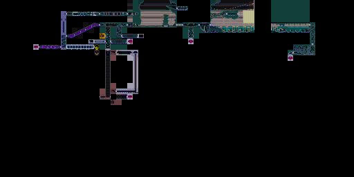
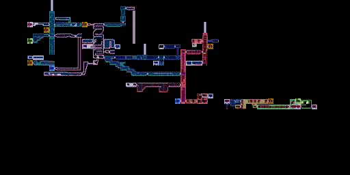
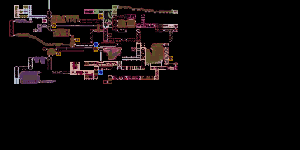

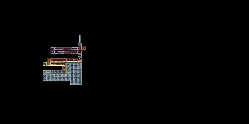
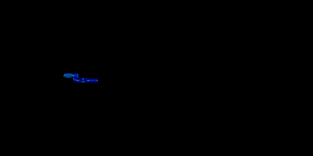
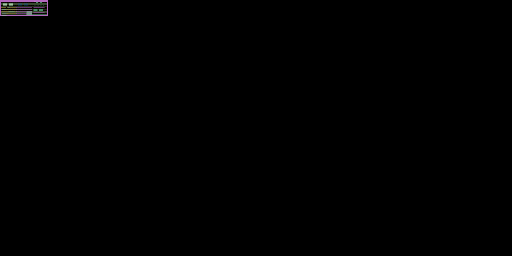

## How does it get there?

I kind of forgot, here's my best attempt ...

I start with the original map.

I size it down from 256x256 to 8x8

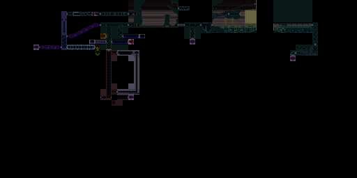

I brighten this up a bit

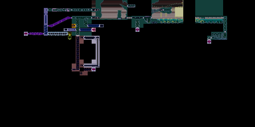

I enumerate all unique 8x8 room sprites:

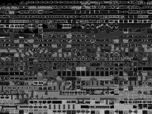
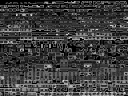
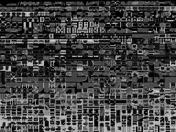
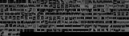
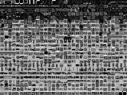
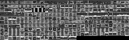
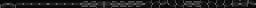
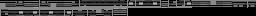

I quantize this.  Left is the resulting tile in the destination image, right is the collection of source image tiles that map to this result:

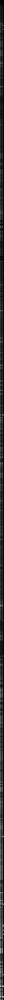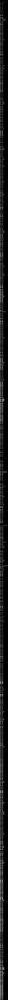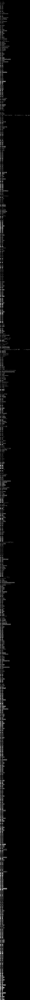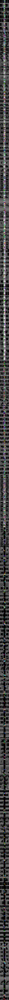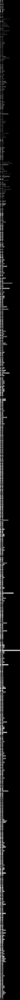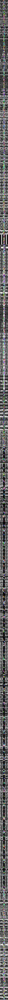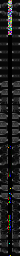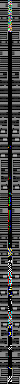

... then rebuild tiles in map from this key

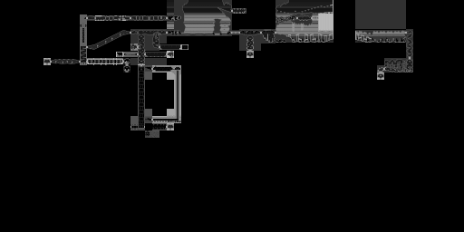
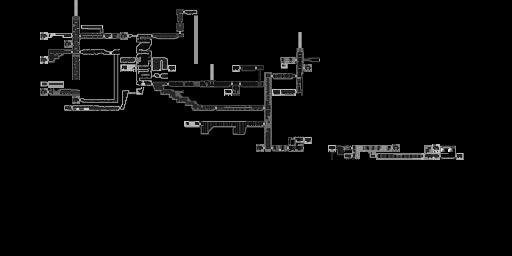
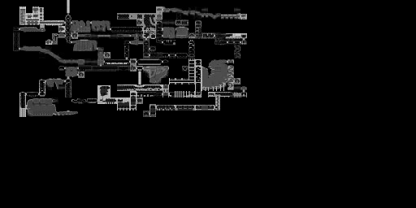
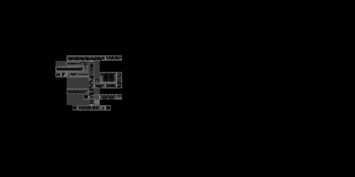
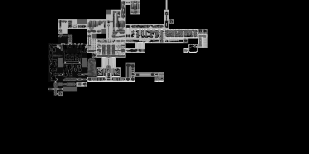
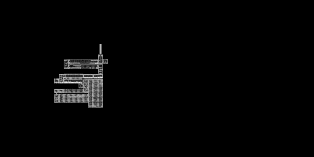
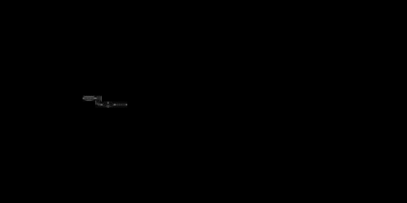
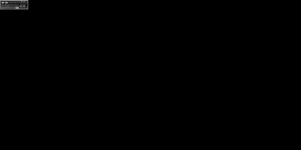

I downsample the image from 256x256 pixels per room to 8x8 pixels per room, and I enumerate all unique tiles:

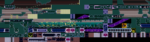
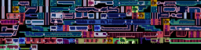
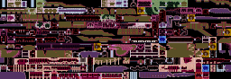
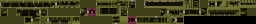
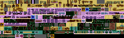
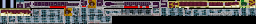

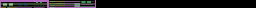

Then I downsample further to 1x1 pixel per room:

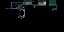

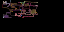

Then I do something else, can't remember

Then I quantize it to 16 colors:

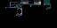

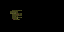
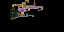

... this gives me the 16 unique palettes to be used for my 16 different high-nibbles.
From there I look at all the tiles associated with each of the 16 groups:

... and I quantize their colors ...

...then collect those 16 quantized 16 colors into 256-color palettes for each region:

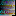 
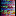 
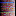 
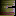 
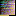 
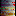 
 
 

... and that brings us to the end:

## How to use this tool:

0) copy images from [super-metroid-randomizer](https://github.com/thenumbernine/super-metroid-randomizer-lua) to here: map-tex.png or map-tex-region-\*.png
1) resize-images.lua to generate 1/32 scale images as map-tex-small.png, map-tex-region-\*-small.png
2) brighten-small-images.lua to generate map-tex-brighter.png, map-tex-region-\*-small-brighter.png
3) run.lua to generate all sorts of debug nonsense, hopefully eventually generate 
	- a 256-color palette, 
	- a 4bpp image of 8x8 graphics tiles (probably 16 tiles wide), no more than 768, or 256, or 80, or so
	- a tilemap indexing into the graphics tiles, specifying 
		- the tile, 
		- whether to flip it horz, or vert, 
		- and what 4bpp upper bits to use for this tile
